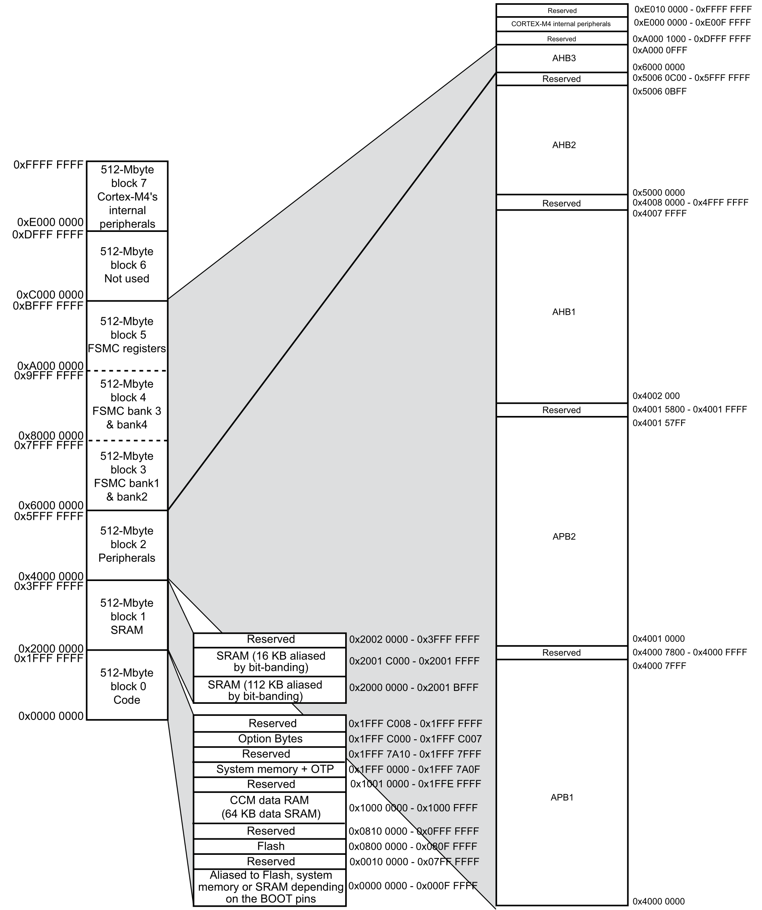
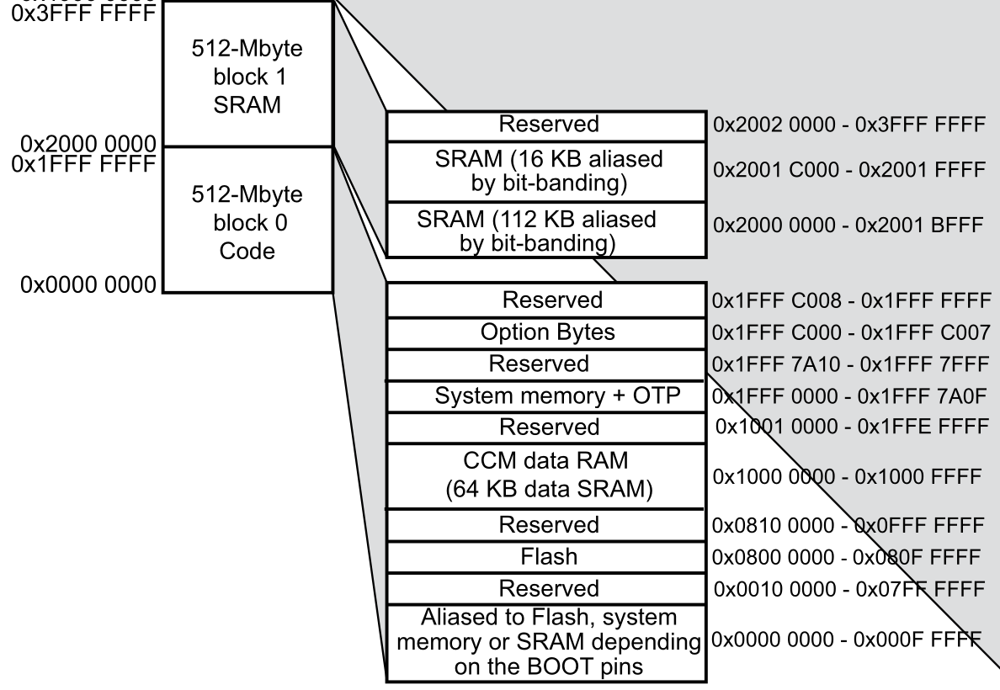

> Tags: embedded systems, C language, embedded C

# Reading for section 01: Introduction to the C language, general C syntax, embedded C, and compilers.

> ### Important! Read Below:

If at this point you have _never, ever_ written software (in any shape or form), I highly recommend you stop here and pick up a programming language tutorial **outside of this one**. Here are some suggestions for your first programming language:

- Python (easiest)
- C++ (the best first language)
- Java (NOT Javascript)

Languages that should not be your first:

- Rust
- Any Assembly language
- C \(1)

> (1) this is debatable, as C is normally a very good first, but for the sake of this tutorial, i think its better to take on a more high level language for a first language.

Once you feel like you have a good grasp on syntax, program structure, and program control, come back to this tutorial.

# C language

**Goal:** Teach the core features of C relevant to embedded development without assuming prior C experience.

---

## 1. Why C?

### History & purpose of C

- C was created in 1972 by Dennis Ritchie at Bell Labs, orignally designed for a complete rewrite of the UNIX operating system; namely, the utility binaries and the Unix kernel.

- At the time, assembly was the most popular language used to program computers, but assembly was too verbose and unreadable. C was created as a _high-level_ alternative to assembly development.

- Despite its age of over 50 years, C still sees usage in device drivers, operating systems, and in our case, embedded systems.

- C does not support object oriented paradigms, like classes, inheritance or encapsulation. C does, however, provide composite data structures via `structs` and `unions`.

### Why C dominates embedded systems

- As stated earler, C is used heavily in embedded systems, with its only real competition being Rust or C++.

- C compiles to fast and predictable machine code with very minimal overhead.

  - Let's take a look at this sentence:
  - C is compiled:
    - A compiled language is different from an interpreted language, like Java or Python.
    - Compiled means that C code is translated directly into native machine code (1s and 0s).
  - Fast and predictable machine code:
    - Predictability is good; this means that optimizations like branch prediction and cache algorithms can do more.
    - C++ has a feature called `templates`, which basically allows for boilerplate code. While this is convenient and more readable, sometimes this will blow up the binary size.
    - Fast is also good, since embedded systems always need to meet real-time requirements.
  - Minimal overhead:
    - Languages like Java use what's called **garbage collectors**. These are background, under-the-hood programs that automatically manages memory for us. Despite the convenience, it makes an impact on performance.
    - C nor C++ do not have garbage collectors; memory management must be coded in alongside the actual program.

- As a direct descendant of assembly language, C allows for direct hardware access. This means we can do:

  - Pointer math
  - Bitwise manipulation
  - Memory mapped I/O

- All of this matters because

  - Microcontrollers have very limited memory (usually hundreds of kilobytes)
  - CPU clock speeds are in the millions (commercial cpus are in the billions)
  - No operating system, and if any, a very barebones RTOS (explained later in this tutorial)

- As for other reasons why C is so widely used in embedded software development, C...
  - is very portable (as a result of its age and popularity)
  - has long term support
  - has extensive documentation
  - if you tell someone your main/fav language is C their opinion of you will improve

---

## 2. Basic Syntax and Program Structure

### `main()` function

- All programs begin execution at main.
- All programs need a main function.
- You can write all the drivers in the world but if they are not called in main they will not run.

It normally looks like: `int main(void)` or sometimes `int main(int argc, char** argv)`.

### Headers and `#include`

- You can make your code modular by including another file with relevant functions.
  - Let's say you wanted to include a module called `animals`.
    - To be clear, modules are not a physical concept in C.
  - You would write your function prototypes in `animals.h`
  - Then you would make a file called `animals.c`, and include `animals.h`.
    - In `animals.c`, you would provide the function bodies (i.e. define them) for all the prototypes listed in animals.
    - Then in a file where you need `animals` functions, you would simply `#include "animals.h"`.

```C
#include "animals.h" // <- in Main (or wherever you need it)
```

```C
#include "animals.h" // <- also put this in animals.c
```

- Sometimes circular inclusions multiple defines can become a head ache.
  - Introduce the header guard, which prevents against multiple defines.

`animals.h` would look like:

```C
#ifndef ANIMALS_H   // <- if animals.h is not defined,
#define ANIMALS_H   // <- then define it here and provide the definition below

#include <stdio.h>  // <- include other includes here and not in the .c file

void dog_bark();    // <- function prototypes
void cat_meow();

#endif              // <- end the if statement here
```

and `animals.c` would look like:

```C
#include "animals.h"        // <- simply include the header file

void dog_bark() {           // <- define the actual functions here
    printf("Bark Woof");    // <- a function defined in <stdio.h>
}

void cat_meow() {
    printf("Meow");
}                           // thats it
```

_Mini-exercise:_ Hello World and compiling with `gcc`. Navigate to the Work.MD file and locate the appropriate tutorial.

---

## 3. Control Structures

Nothing really changes here across languages. They practically work the same way.

Here are a few examples. Assume all snippets of code are inside a main function, for conciseness purposes.

### Basic `if`, `else`, `switch` examples

```C
int number = 10;

if (number > 0) {               // <- enclosed in brackers
    printf("%d is positive", number);
}

else if (number < 0)
    printf("%d is negative");   // <- inline if/else only works if its just one statement

else printf("Zero");            // <- another way to do inlines
```

```C
int day = 3;

switch (day) {      // <- the value controlling the switch case must be an integer-compatible type
    case 1: printf("Sunday");
    case 2: printf("Monday");
    case 3: printf("Tuesday");
    case 4: printf("Wednesday");

    default: printf("Invalid");
}
```

```C
char c = 'A';       // This is valid, chars evaluate to integers by ASCII or UNICODE

switch (c) {
    case A: //...
    case B:
    case S: // doesnt have to be in alphabetical order

    //...
}
```

```C
float PI = 3.14159; // This is NOT valid

switch (PI) {
    //...
}
```

### Loops: `for`, `while`, `do-while` examples

```C
for (int i = 0; i < 3; i++) {
    printf("  i = %d\n", i);
}
```

```C
while (j < 3) {
    printf("  j = %d\n", j);
    j++;
}
```

The difference between a `while` and a `do-while` loop is that a `do-while` loop is guaranteed to run at least 1 iteration, and a normal `while` loop may not run at all if the condition is not satisfied at run time.

```C
do {
    printf("  k = %d\n", k);
    k++;
} while (k < 3);
```

### Control flow modifiers: `break`, `goto` and `continue` examples

These come in handy sometimes, but the caveat is that they are harder to maintain, read, and trace.

```C
for (int i = 0; i < 5; i++) {
    if (i == 3)
        break;  // Exit loop when i is 3
    printf("  i = %d\n", i);
}
```

Usage of `break` is heavily discouraged.

```C
for (int i = 0; i < 5; i++) {
    if (i == 2)
        continue;  // skip printing when i is 2
    printf("  i = %d\n", i);
}
```

As you will come to realize in later sections, `goto` is basically an assembly instruction. Usage of `goto` is also discouraged.

```C
int x = 1;
if (x == 1)
    goto skip_print; // your routine can be before or after the goto statement

printf("  This line is skipped.\n");

skip_print:         // <- you must define a routine named skip_print here
    printf("  Jumped to label using goto.\n");

```

---

## 4. Variables, Data Types and Data Structures

Unlike languages like Javascript or Rust, you must declare the type of your variable during declaration. If your variable's type does not match the literal type, the compiler will throw an error.

```C
float d = "ABCDEFG"; // <- is not valid
```

### Primitive types: `int`, `float`, `char`, `double`

| Type     | Description                     | Example             |
| -------- | ------------------------------- | ------------------- |
| `int`    | Integer values                  | `int age = 30;`     |
| `float`  | Single-precision floating point | `float pi = 3.14;`  |
| `double` | Double-precision floating point | `double x = 2.718;` |
| `char`   | Single byte character           | `char c = 'A';`     |

Suprisingly, a `string` is not a primitive data type in C. C considers traditional strings to be arrays of `char`.

Typically you can define a "string" like this:

```C
char* str = "Hello, World!";
```

You'll notice that this looks similar to something in the `main` function signature you saw earlier.

```C
int main(int argc, char** argv);
```

But this one has two stars `char**`.
If `char*` is an array of `char`, it would make sense that `char**` is an array of `char*`.

In other words, the `char**` you see is an array of strings. More on this later.

### Type specifiers: `unsigned`, `long`, `short`

| Specifier  | Purpose                                 | Example                |
| ---------- | --------------------------------------- | ---------------------- |
| `short`    | Shorter integer (usually 16 bits)       | `short x = 100;`       |
| `long`     | Larger integer (at least 32 or 64 bits) | `long x = 100000L;`    |
| `unsigned` | Only positive values (no sign bit)      | `unsigned int y = 42;` |

### Type sizes and portability (`stdint.h`)

We can use type specifiers all the time using `unsigned`, `long`, `short` but this gets repetitive pretty quickly and surprisingly is still limiting; depending on the platform, you actually can't guarantee that a `unsigned long` is 64 bits wide.

If we want even more control over the size of a variable, we can use the `<stdint.h>` library that C provides.

Here, we can manually set the size of integers:

| Signed    | Unsigned   |
| --------- | ---------- |
| `int8_t`  | `uint8_t`  |
| `int16_t` | `uint16_t` |
| `int32_t` | `uint32_t` |
| `int64_t` | `uint64_t` |

A prepended `u` means that it is unsigned. The number that follows is the bitwidth.

So for example, `uint8_t` is a type of unsigned integer, 8 bits wide. There is another name for this: the `byte`.

We use this in embedded software development quite frequently as it allows for control over how much memory is used, as we don't want to give 64 bits to a value we know for a fact will be less than 16, and vice versa. These small optimizations in memory add up, and vice versa, punish performance when we don't.

### A Quick Brief on Typedefs

You'll notice that all those `uint8_t`s and all end in `_t`.

The `_t` suffix stands for "type", which is a naming convention that the relevant data type is a `typedef`.

We sometimes use `typedef` to create custom names for existing types. We do this for readability and if used correctly, simplifies the code as well.

```C
typedef existing_type new_type_name_t;
```

We also use `typedef` when dealing with structs, but we will cover that later.

---

## 5. Structs, unions, and `typedef`

Structs are user defined data types that are groupings of different types under a single name. Usage in processing hardware registers, sensor data packets and many more cases.

### Declaring and using structs

Declare a struct like so:

### Nested structs

### `typedef` for clean code

### When to use `union`

_Mini-exercise:_ Define a `struct` for sensor data

---

## 6. Functions

One of the most important parts of programming.

### Syntax: return types, arguments

All functions carry the same structure:

```C

<return_type> function_name(arg1_t arg1name, arg2_t arg2name, argn_t argnname);

```

Sometimes, a function might not have a return type, which is typical of functions doing some sort of initialization.

In that case, it will look like:

```C
void Something_Init(arg1_t arg1name, arg2_t arg2name, argn_t argnname);
```

In other cases, a function may not take any arguments. That looks like:

```C

<return_type> function_name();

```

Functions can return custom types and take custom types as arguments.

```C
typedef struct {
    int rows;
    int cols;
    float* data;
} matrix_t;
```

```C
matrix_t matrix_transpose(matrix_t m) {
    matrix_t mt = create_matrix(m.cols, m.rows); //<- assume this has been implemented
    if (!t.data) return t;

    for (int i = 0; i < m.rows; ++i) {
        for (int j = 0; j < m.cols; ++j) {
            t.data[j * m.rows + i] = m.data[i * m.cols + j];
        }
    }

    return mt;
}
```

Something to think about: why do you think init functions don't return a OK status?

The answer is that failure is either considered fatal and most of the time very unlikely. If the setup fails, there's no point in handling the error because there's nothing you can do to recover. There are exceptions to this, especially when smaller (i/o peripheral) inits are called.

### Scope: local vs global

In the matrix transpose example above, the `for-loop` counters `i` and `j` are local variables.

```C
for (int i = 0; i < m.rows; ++i) {
        for (int j = 0; j < m.cols; ++j) {
            t.data[j * m.rows + i] = m.data[i * m.cols + j];
        }
    }
```

The variable `j` is not accessible outside of the inner `for-loop` but the variable `i` is accessible within the inner `for-loop`.

Global variables are placed outside of any function and are placed in global memory, not stack memory.

If you define a variable such that:

```C
int myGlobalVariable = 42;

int main() {...}
```

then `myGlobalVariable` is accessible by any function in the file.

To extend this even further, one can use the `extern` keyword. This means that a variable was externally defined. If in `animals.c` I write:

```C
int NUM_DOG = 9;
```

and in `main.c` I declare:

```C
extern int NUM_DOG;
```

then from within `main.c` I can access the variable `NUM_DOG` that was declared in `animals.c`.

A couple caveats to the `extern` keyword: if the variable is defined more than one after `extern` is declared, you will get a linker error.

### Helper functions //TODO

When writing functions, sometimes it's helpful to write smaller, helper functions that do a specific sub task. This is especially useful when the subtask is repetitive.

```C
typedef struct {
    int id;
    double temp_in_celsius;
    double humidity;
} temp_sensor_packet_t;

void print_sensor_data(temp_sensor_packet_t* s, int celsius) {

}
```

When considering whether to write a separate helper function

---

## 7. Pointers and Memory

Pointers and memory manipulation are one of the most powerful tools that the C language gives us.

It also happens to be one of the most error prone parts of C development.

Unfortunately, as embedded software developers that constantly interface with hardware, this is not something we can avoid.

Read this before continuing: [How to read the hexadecimal numbering system](https://learn.sparkfun.com/tutorials/hexadecimal/all)

### Types of memory

C programs typically operate with 4 distinct memory regions.

| Memory Segment  | Serves                                | Managed By            |
| --------------- | ------------------------------------- | --------------------- |
| **Stack**       | Local variables, function calls       | Compiler              |
| **Heap**        | Dynamically allocated memory          | the user via `malloc` |
| **Data**        | Global/static initialized variables   | OS/loader             |
| **BSS**         | Global/static uninitialized variables | OS/loader             |
| **Text (Code)** | Executable instructions               | OS/loader             |

### Memory in software

### Heap memory

### Stack memory

Stack memory is where local variables and functions "live" during runtime. It's commonly depicted as an upside-down [stack](<https://en.wikipedia.org/wiki/Stack_(abstract_data_type)>).

Stack frames are 'frames' or structures of data that get pushed on to the stack. In the case of the call stack, a call stack frame contains local variables and functions related to the function call.

The stack is limited and does not grow in size. If too many stack frames are placed on the call stack and exceeds the address space for the call stack, this is known as stack overflow.

We can manage memory hardware using the C language via the following functions:
`malloc`, `calloc` and `free`.

### Memory in hardware

On the hardware side, there are two types of memory: **S**tatic RAM and **Dynamic** RAM.

A brief overview on the differences:

#### SRAM

- is bigger (6 transistors),
- faster
- and more expensive

#### DRAM

- is smaller (1 capacitor),
- slower
- and cheaper

DRAM uses capacitors, which means that it slowly leaks charge over time.
This means that DRAM cells must be periodically refreshed, which is why it's called dynamic.

We will talk about this more in later sections, but know that SRAM is more suited to cache memory, and DRAM is more suited to main memory.

### What is a pointer?

A pointer is a variable that holds the memory address of another variable. A pointer may store it's own memory address, but that's pointless (haha).

```C
int num = 10;
int* ptr = &num;
```

In the example above, `num` is just a normal integer variable. `ptr` holds the **address** of the variable `num`. Therefore, if I dereference `ptr` by `*ptr`, it will return `10`.

### `*`, `&`, pointer arithmetic

### Arrays vs pointers

### Allocation

#### `malloc`

`malloc(size_t s)` returns the address of the allocated memory of size `s`.

`malloc`ed memory is unintialized, meaning you cannot reference it until you put something in that memory region.

```C
int *p1 = malloc(4*sizeof(int));
```

#### `calloc`

Does the same thing as `malloc` except initializes everything inside the memory block to `0`.

`n` is the number of objects and `type` is the data type.

```C
int* p1 = calloc(n, sizeof(type));
```

#### `free`

`free(void* ptr)` deallocates the region of memory that the pointer points to.

The pointer itself still exists, as a "dangling pointer". Its value still points to the same memory address, but that memory address is now no longer allocated.

Ending the object’s lifetime invalidates all pointers to the object ~instantaneously, and therefore any use of a dangling pointer whatsoever. Even `printf("%p")` is undefined behavior.

`free` is not guaranteed. In fact, none of the memory functions are guaranteed -- `malloc` can fail if there is not enough memory in reserve to afford it.

### A memory map

A memory map is helpful in visualizing the different sections of memory and what the sections are dedicated to.

Memory-mapped I/O (MMIO) is when computers use the same address space to host the main memory (heap, stack and BSS from earlier) AND I/O devices.

Disclaimer: this memory map is based off of STM32 MCU documentation, and all MCUs use the following memory map to some degre. This is a general diagram not specific to any line of chipsets manufactured, and applies to most of them. That said, there are always a few minor differences.

Look at the picture below:




Notice that the top of the memory diagram is the bigger number and the number at the bottom is 0. We call this the high address and the low address, respectively.




This zoom in focuses on an area of interest:

- Flash memory at `0x0800 0000` is where you upload your application, which the process for that is called `flashing`. Notice that the flash address ends at `0x080F FFFF`, meaning that we have `0x080F FFFF` - `0x0800 0000` = `0x000F FFFF` bits of memory that we can use for flash memory.

  - If you know how to count in base-16 (aka Hex), you know that `0x000F FFFF` is equivalent to `1048576` bits (divided by `8`) = `131072` bytes (divided by `1024`) = exactly `128` KB.

- Anoter region of note in the zoom-in is the RAM, starting at address `0x2000 0000`. This is where dynamic memory is allocated.

#### Memory architecture will be discussed in more detail in later sections.

For now, know the different sections of memory and that we can manipulate external using memoery locations via MMIO.

### Types of memory-based errors

#### Dangling pointer

#### Wild pointer

#### Double free

#### Memory leaks

### Common mistakes / examples of bad memory management

_Mini-exercise:_ Swap two integers using pointers

---

## 8. Important Keywords

### `volatile`: why it matters in hardware

The `volatile` keyword tells the compiler that the relevant variable may change without notice to the compiler. This is especially useful when we are performing **direct memory access** (DMA) operations. DMA, without going into too much detail (we will look more into DMA later), is when memory read and write skips CPU control and hardware memory is directly read from or written to.

```C
#define DMA_BUFFER_SIZE 256
volatile uint8_t dma_buffer[DMA_BUFFER_SIZE];  // Mark volatile

void dma_init() {
    // Start DMA transfer (pseudo-code)
    start_dma_transfer(dma_buffer, DMA_BUFFER_SIZE);
}

void poll_dma() {
    while (!dma_transfer_done()) {
        // Wait
    }

    // Process DMA buffer (compiler knows it can change!)
    for (int i = 0; i < DMA_BUFFER_SIZE; ++i) {
        process_byte(dma_buffer[i]);
    }
}

```

DMA is not the only application for the `volatile` keyword! Some memory values might change during multithreading or even multicore operations.

If the `volatile` keyword is not used, the compiler might re-use cached values or values within the hardware registers (which the compiler does automatically via compiler optimizations). Read more on compiler optimizations [here](https://en.wikipedia.org/wiki/Optimizing_compiler).

### `const`, `static`, and `extern`

The constant modifier does the same thing in C as with other languages (`final` in Java). It tells the compiler that the relevant variable will never change during runtime, and therefore prevents write operations on that variable.

The `static` keyword is a scope modifier. Usually, you will see the static keyword in these places:

- A static variable inside a function keeps its value between invocations.

- A static global variable or function is "seen" only in the file in which it's declared.

The `extern` keyword is used to declare a variable or a function whose definition is present in some other file.

Generally, the variables and functions defined inside a C source files are only used inside that file. But in large projects where code is split across multiple files (or translation unit), users may need the data, or a part of code defined in another translation unit into the current one. This can be done with the help of extern keyword.

Generally (with STM32), you will see a hardware peripheral handler like UART defined like this in `usart.c`.

```C
#include "usart.h"

UART_HandleTypeDef huart2;

void MX_USART2_UART_Init(void)
{
    huart2.Instance = USART2;
    huart2.Init.BaudRate = 115200;
    huart2.Init.WordLength = UART_WORDLENGTH_8B;
    huart2.Init.StopBits = UART_STOPBITS_1;
    huart2.Init.Parity = UART_PARITY_NONE;
    huart2.Init.Mode = UART_MODE_TX_RX;
    huart2.Init.HwFlowCtl = UART_HWCONTROL_NONE;
    huart2.Init.OverSampling = UART_OVERSAMPLING_16;

    if (HAL_UART_Init(&huart2) != HAL_OK)
    {
        Error_Handler();
    }
}

```

Then in `usart.h` you would see it `extern`ed like so:

```C
#ifndef __USART_H__
#define __USART_H__

#include "stm32f0xx_hal.h"

extern UART_HandleTypeDef huart2;

void MX_USART2_UART_Init(void);

#endif
```

### `__attribute__((weak))` for override-able definitions

### Memory-mapped I/O example

_Mini-exercise:_ Simulate an LED toggle register

---

## 9. Style and Best Practices

### Naming conventions

### Header files and code organization

### Commenting and documentation style

### `#define` vs `const`

---

## 10. Compilers and Build Systems

### The big idea

Before your written `.c` file is turned into something that actually runs on the CPU, it must be preprocessed, compiled, the assembled, then linked, then loaded. Only then can it be ran.

#### The preprocessor will:

- remove comments,
- expand macros
- expands included files

This is why `#define`s or `#include`s are also called _preprocessor directives_.

The preprocessor outputs a `.i` file.

#### The compiler

From the raw source code created by preprocessing, the compiler will perform
lexical, semantic and syntax analysis (using an abstract syntax tree) and translate your code into intermediary assembly.

It is responsible for turning your written `.c` file into an `.o` object file.

#### Assembler

The assembler simply translates the assembly into machine code. With the exception of pseudo instructions, each assembly instruction is one-to-one to a direct machine code instruction.

#### Linker

The linker, from the `.s` file, resolves symbols, external functions and addresses to global variables.

A linker or link editor is a computer program that combines intermediate software build files such as object and library files into a single executable file such as a program or library.

A linker is often part of a toolchain that includes a compiler and/or assembler that generates intermediate files that the linker processes. The linker may be integrated with other toolchain tools such that the user does not interact with the linker directly.

(Windows only) If you are familiar with `.dll` files, these are involved with the linker. DLL stands for dynamically linked library, and it means multiple programs can access the same library.

The linker will finally produce a compiled binary, ready for execution.

#### Example

Look at `example.c` in the examples folder. If you run `gcc -E example.c -o example.i`, you will see the raw source code after preprocessing.

After, run `gcc -S example.i -o example.s` to see the assembled code. Take a good look at it, as you will be writing assembly in the following sections.

To see the object file, run `gcc -c example.s -o example.o`. This is the machine code just before linking. It is not ready to run yet.

Finally, to get the final executable, run `gcc example.o -o example`. The output file `example` can now be run by `./example`.

Try it out for yourself! Remove everything but the `example.c` and run `gcc -save-temps example.c -o example` to see all the intermediate steps.

A hexdump is a textual hexadecimal view of the executable. Hexdump in `xxdoutput.txt`. Run `xxd example >> xxdoutput.txt` to see for yourself.

## 11. Closing Note:

All of these parts of the C language are useful in their own right. But with each feature you introduce an additional layer of complexity. Sometimes being additive can take away from your code. Ask yourself: "Does this need to be so complex?". If it doesn't need to be abstracted, don't abstract it.

It's up to you to decide when and where all of these C language features will be useful or not. That's what makes good developer, not just knowing the syntax but when to apply and not apply all of these concepts. That isn't something that can be explained in a short paragraph, it is earned with time and experience. So the best thing you can do is go and build something. Which brings me to this section's final assignment.
