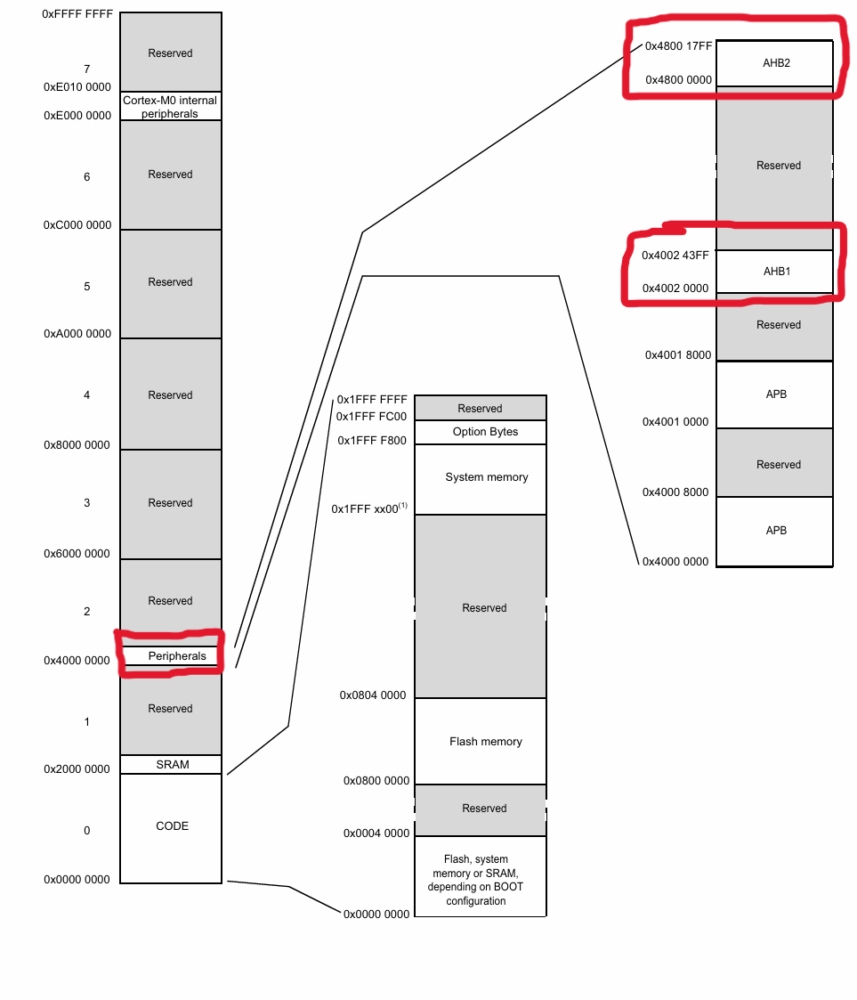
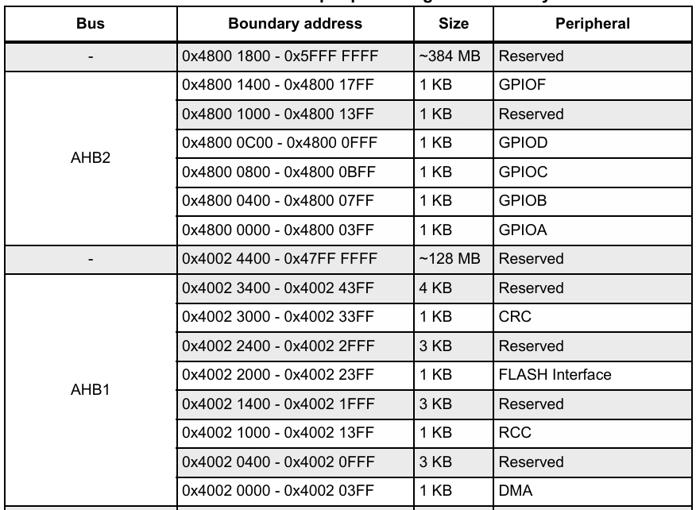

> Tags: Assembly, Armv8 Assembly, embedded systems, registers, HAL

# Computer Architecture

This section teaches you how to build a [Minecraft redstone computer.](https://www.youtube.com/watch?v=CW9N6kGbu2I)

You will also learn how a computer is structured, how memory works, how to program in assembly and how to take advantage of these characteristics.

In these tutorials, we will be studying the ARM architecture, which is a Reduced Instruction Set Computer (RISC) architecture. More specifically, we will be developing using ARMv6-M and similar families of assembly to supplement your learning of hardware and software.

In contrast, the x86 architecture, which you may be more familiar with due to it being a product of [Intel](https://en.wikipedia.org/wiki/Intel_8086) and [AMD](https://en.wikipedia.org/wiki/Opteron), is a Complex Instruction Set Computer (CISC).

The primary goal of CISC architecture is to complete a task in as few lines of assembly as possible. This is achieved by building processor hardware that is capable of understanding and executing a series of operations. Thus, as the name suggests, it has a more complex instruction set.

On the other hand, the RISC school of thought strives to only use simple instructions that can be executed within one clock cycle. More accurately, it aimrs to use a small, regular set of simple instructions that are easy to **pipeline** and optimize in hardware. This simplicity enables more predictable performance and efficient instruction execution, often within a single clock cycle. This means that developers will be writing more lines of assembly per task, but it also means that we as developers have more control over the software we execute.

Unfortunately, despite the advantages of RISC based processing, RISC chips took over a decade to gain a foothold in the commercial world. This was largely due to a lack of software support that companies in the early 1990's were not willing to invest in...

There are many caveats to each design theory, and in practice, modern architectures often incorporate elements of both. However, understanding these core philosophies gives you the insight needed to reason about performance, efficiency, and system design.

## You should already know...

- C language fundamentals
  - data types
  - functions, arguments and return values
  - control structures (`if`, `else`, `for`, `while`)
  - how to use pointers (both function pointers and data pointers)
  - the different regions of memory and their purposes
    - how each region works
  - bitwise operations (`&`, `|`, `^`,` ~`, `<<`, `>>`)
- Compiling process
  - preprocessing, compiling, assembling, linking
  - purpose of `.c`, `.h`, `.o`, `.elf`, and linking object files
  - basic use of Makefile or build systems like cmake

If any of the items above are unfamiliar or unclear, go back and review the C Language section before proceeding.

## 0. Motivation of understanding a computer's architecture

You might have guessed by now that you will be writing assembly in this section. But that's not all that this section has to offer. So why do we care about computer architecture?

1. Your C code is **not** the whole story:

   - Despite the majority of your development being that you will be writing, compiling, debugging and executing C code, that is not where you can stop caring.
   - What's actually getting executed and how it's being executed is entirely up to the registers, instructions, stack frames and memory layout — many of which you may not understand how to use without knowing many of the computer architecture concepts that are taught here.

2. Embedded systems = talking **directly** to hardware:

   - Microcontrollers don't have (general purpose) operating systems to abstract things and manage resources for you.
   - You will be toggling bits inside registers, you will be managing timing down to the clock cycle.
   - You have to understand how memory is laid out, what registers do and what the compiler is doing behind the scenes.

3. Debugging
   - Why does this variable change randomly?
   - Why did the system crash after a function call?
   - Why is my ISR returning to the wrong place?
   - All of these are questions you will be answering when you are debugging (notice how I said when, not if. You will run into bugs at one point during your career.) Without knowledge of computer architecture, you will not know how to use the GDB or get use out of it.
   - Other debugging tools like `objdump` or `nm` are only incredibly useful if you know computer architecture.

Without computer architecture, you're programming blindly.

Pretend you are running code on a computer, with no pins, no peripherals, no anything. Just a CPU.

Now we add pins whose logic levels are directly connected to the status of certain registers or memory locations.

Now we have to manipulate the memory of those memory locations in order to change a pin's logic level.

This is the basis of embedded development. It's still software, except now certain parts of your CPU are now connected to the outside world.

## 0.1 Some prerequisite topics

### Clock

The clock is the heartbeat of any computer and produces a steady, square wave output from either an internal crystal oscillator or an external one.

Intuitively, we know that computers are clock controlled because if we were to run an empty loop like so:

```C
for (int i = 0; i < 1000000; ++i); // one million times
```

Though this _appears_ to execute almost instantly, we know that it doesn't. For me, it takes 0.000681 seconds. If I ran

```C
for (int i = 0; i < 50000000; ++i); // fifty million times
```

I can see it takes 0.022914 seconds, which is longer. While it's not exactly 50 times slower, (it's about 33 times slower), we can see that even though these loops “do nothing,” the CPU still executes multiple instructions per iteration:

- incrementing the counter,
- comparing it to the limit,
- branching

and each of those operations consumes clock cycles. The work is invisible to the user, but it's still happening step-by-step in hardware.

---

The clock signal is a digital signal (meaning it has only 2 logic levels: 0 and 1) and looks like this: especially registers and memory.

```
Time   →      0   1   2   3   4   5   6   7   8   9   10
Level  →     ───┐   ┌───┐   ┌───┐   ┌───┐   ┌───┐   ┌───
                └───┘   └───┘   └───┘   └───┘   └───┘
Binary →      1   0   1   0   1   0   1   0   1   0   1

```

Let's talk about the picture. Between time 0 and time 1 (similarly between time 3 and 4 or time 7 and 8) the clock goes from logic level 0 to logic level 1. We call this a rising edge. Conversely, between time 1 and time 2, the logic level goes from 1 to 0. We call this the falling edge of the clock.

**Many components of the computer are controlled by the rising edge of the clock, such as registers and memory.**

Without diving too much into digital circuits, the clock is one of the core components of any computer.

Question for you: if the clock is purely in control of how quickly my CPU can execute something, why can't we just crank up the clock speed for more performance?

Answer: Let's say signals propagated instantly, we have unlimited money for the electricity bill and you had a cooling system capable of swapping heat at 100% efficiency. Then yes, we can do this.

But unfortunately, these conditions do not hold in the real world.

### How we measure a computer's performance

A computer's performace is measured by the following ratio:

$$
\frac{\text{time}}{\text{program}}
$$

"How much time does it take to execute this program?"

But this is a very broad question and can't do much with it, so we can expand the original equation as such:

$$
\frac{\text{time}}{\text{program}} = \frac{\text{time}}{\text{cycle}} \times\frac{\text{cycles}}{\text{instruction}} \times \frac{\text{instructions}}{\text{program}}
$$

And now this is a much more solvable equation.

### Endianness

Endianness basically describes the placement of the most signficant bit and the least signficant bit (obviously they must be on the opposite side of each other).

In little-endian systems, the least significant byte is stored first (at the lowest memory address).

In big-endian systems, the most significant byte comes first.


Either one isn't necessarily better than the other. Endianness is primarily the result of architectural design choices made when the processor was developed.

Each approach has trade-offs:

**Little-endian**

- Easier incremental byte addressing (useful in some low-level memory and pointer operations).

- Commonly used in x86 and most modern general-purpose processors.

- Makes certain arithmetic and data serialization tasks simpler.

**Big-endian**

- More human-readable in memory dumps since the most significant byte comes first (matching how numbers are typically written).

- Historically common in network protocols and some older architectures (e.g., Motorola 68k, SPARC).

## 1. The Assembly Language

### What is an instruction

Because assembly language is often 1:1 correlated with actual machine language (as in 1s and 0s), an assembly instruction usually corresponds to one machine instruction.

Because all\* computers are some combination of digital electronics, the machine instruction must be comprised of only two logic levels: voltage high and voltage low, or as we use: 1s and 0s.

### Word

In computing, a word is any processor design's natural unit of data. A word is a fixed-sized datum handled as a unit by the instruction set or the hardware of the processor. Another way of saying this is that a computer's register can hold one word.

The number of bits or digits in a word (the word size, word width, or word length) is an important characteristic of any specific processor design or computer architecture.

For example, for a 64 bit computer, the word size is 64 bits.

### Instructions

### Inline Assembly

Inline assembly (typically introduced by the `asm` keyword) gives the ability to embed assembly language source code within a C program.

If I wanted to use the `nop` operation (which does nothing), in a C file, I would use:

```C
asm("nop");

// or
__asm("nop");

// or
__asm__("nop");
```

It is provided by the `<stdio.h>` library.

## 2. Register File

The concept of computer registers are essential to computer architecture as a whole. The register file is the collection of registers organized within the central processing unit (CPU).

### Registers

Registers are areas in the CPU where data can be processed. CPUs don’t operate on memory directly, but instead data is loaded into registers, processed, and written back to memory. In assembly language, generally, you cannot directly copy data from one memory location to another without first passing that data through a register.

Registers are normally measured by the number of bits they can hold, and denote that computers bit width; for example, a 32 bit computer has 32 bit registers.

Registers are often the smallest structure of memory any computer can use. Registers are not cache, and cache memory is something else entirely.

### General Purpose Registers

The first type of register is what is known as a General Purpose Register (GPR). GPRs are referred to as general purpose because they can contain either data, in this case up to a 64-bit value, or a memory address (a pointer). A value in a GPR can be processed through operations like addition, multiplication, shifting, etc.

General purpose registers can be thought of as your scratch paper. It largely does not matter what a general purpose register holds as long as the concept of execution remains untouched; they are flexible, and as the name suggests, multi-purpose.

### Special Registers

The second type of registers are special registers. These generally do not hold data but exist to maintain the state of execution for a program. Most computer systems have these registers.

#### Program Counter (PC)

The program counter register points (i.e. holds the address) to the current instruction being executed. It is the CPU’s built-in tracker for where it is in your program. It always holds the memory address of the next instruction the CPU will run.

Every time the CPU completes an instruction, the PC moves forward to the next one. If you run a branch or jump, the PC is updated with a new address so the CPU can continue somewhere else.

#### Stack Pointer (SP)

The stack pointer points to the top of the stack. The stack holds your saved general purpose registers and the return address. Like in section 1, when the Stack Pointer exceeds your allocated RAM region for the stack, you get stack overflow and the memory it reads is no longer valid, which will either trigger a segfault (only on computers with memory protection) or silently fail (more likely with embedded cores).

#### Link Register (LR)

The link register holds the return address of a function. Returning from a function often involves moving the contents of LR into PC. When a function is called, the CPU needs to remember where to come back to after the function finishes. Instead of always pushing that address onto the stack, many architectures have a dedicated link register for this purpose.

### Other reserved registers

Sometimes certain architectures have more reserved registers. Some are operating system reserved, sometimes not.

ARM has a few more special registers that are largely architecture-dependent that should be mentioned here. These are known as program status registers (PSR). Physically speaking, the PSR is actually three registers combined into one to save space.

#### Arithmetic flag PSR (APSR)

holds condition flags from arithmetic/logical ops, which can be one of `N` for negative, `Z` for zero, `C` for carry, and `V` for overflow.

#### Interrupt PSR (IPSR)

holds the exception number of the currently running handler. 0 means the CPU is running in Thread mode (normal program execution). Nonzero values indicate Handler mode — the CPU is servicing an exception or interrupt.

For example, `IPSR` = `16` means that the SysTick handler is running. `IPSR` = `3` means that the HardFault handler is running. This is useful for debugging which interrupt you’re in or writing code that behaves differently depending on whether you’re in normal execution or interrupt context.

#### Exectution PSR (EPSR)

holds the execution state. It's main jobs are to keep the T-bit set to indicate Thumb execution and track if-then blocks' progress and condition. As a developer, you do not have to worry about this too much, as it is mostly handled by the computer for you.

### Hardware Registers with Memory Mapped I/O

If you remember the `volatile` example from the previous section, I explained why the `volatile` keyword has to be used when accessing memory-mapped hardware registers, to prevent the compiler from optimizing away reads and writes that have real hardware effects.

That was an example of accessing hardware through registers. We are going to extend that by explaining memory mapped i/o.

### GPIO Example

Recall this example:

```C
#define GPIOA_ODR   (*(uint32_t*)0x48000014) // NO volatile!

int main(void) {
    while (1) {
        GPIOA_ODR |=  (1 << 5); // set PA5 high
        GPIOA_ODR &= ~(1 << 5); // set PA5 low
    }
}
```

Let's fix it to include the `volatile` keyword like it's supposed to:

```C
#define GPIOA_ODR   (*(volatile uint32_t*)0x48000014) // no opts now

int main(void) {
    while (1) {
        GPIOA_ODR |=  (1 << 5); // set PA5 high
        GPIOA_ODR &= ~(1 << 5); // set PA5 low
    }
}
```

On an ARM Cortex-M microcontroller, the chip vendor defines a **memory map** — a table assigning specific address ranges to different peripherals.
For example, part of the address space might look like this:

| Address range      | Peripheral  |
| ------------------ | ----------- |
| `0x40000000` – ... | Timers      |
| `0x40010000` – ... | USARTs      |
| `0x48000000` – ... | GPIO Port A |
| `0x48000400` – ... | GPIO Port B |

Look, here's a familiar diagram:



Let's look closer at the AHB1 section. The AHB1 data bus is part of the MCU’s internal interconnect. When your code writes to a GPIO register, the CPU issues the write, the request travels over AHB1 to the GPIO peripheral, and the peripheral logic updates the pin state. This is how your code to toggle a GPIO Pin goes from executing in the ALU to the pin turning on and off.



Within the GPIO block for Port A, there are multiple **control registers** at fixed offsets:

- `MODER` (mode configuration)
- `OTYPER` (output type)
- `IDR` (input data)
- `ODR` (output data)

In our example:

```c
#define GPIOA_ODR (*(volatile uint32_t*)0x48000014)
```

- `0x48000000` is the base address for Port A’s register block.
- `0x14` is the offset to the **Output Data Register** (ODR).
- Dereferencing that address (`*`) lets you read or write the 32-bit register directly.
- Bit 5 in that register controls PA5’s output state — setting it drives the pin high, clearing it drives the pin low.

When the CPU executes:

```c
GPIOA_ODR |= (1 << 5);
```

it:

1. Reads the 32-bit word at address `0x48000014` from the peripheral bus.
2. Modifies the bit pattern in a CPU register.
3. Writes the modified word back to the same address, which updates the GPIO output latch.
4. The GPIO hardware then changes the electrical state of the PA5 pin.

This is why we say **peripherals are accessed via registers** — each control or status register is just a fixed memory address wired to a hardware block, and reading/writing it controls or queries that block.

### Hardware Abstraction Layer

A **Hardware Abstraction Layer** wraps these raw register manipulations in higher-level, vendor-provided functions:

```c
HAL_GPIO_WritePin(GPIOA, GPIO_PIN_5, GPIO_PIN_SET);
```

Internally, this might:

1. Enable the GPIOA clock if it’s not already on.
2. Access the correct set/reset register (e.g., `BSRR`) instead of doing a read-modify-write on `ODR`.
3. Handle device-specific quirks for that pin or port.

The result is cleaner, more portable code, at the cost of extra overhead. For performance-critical loops, direct register access (with `volatile`) is still the most predictable and efficient method.

## 3. Memory

### Cache

Recall the memory in hardware section in the previous section

Cache memory is smaller memory than main memory (RAM) and closer to the CPU. It's not to be confused with the register file, which is still it's own thing. Cache is bigger than the register file. Cache is implemented via SRAM, and main memory (RAM stick memory) is implemented via DRAM.

Computers use the cache memory as an intermediary space between main memory and the register file as the register file is extremely limited in space but main memory is to slow for the CPU.

To be loaded into the CPU, data (or instructions) must make their way from disk storage, main memory, the lower cache levels (L3), the higher cache levels (L1), and finally the register file. To unload, it follows the reverse of the pattern.

We don't really mess with the cache in embedded development, but the distinction between the register file (which we use a ton of in embedded development) is important.

### Memory Alignment

It consists of three separate but related issues: data alignment, data structure padding, and packing.

The CPU in modern computer hardware performs reads and writes to memory most efficiently when the data is naturally aligned, which generally means that the data's memory address is a multiple of the data size.

For instance, in a 32-bit architecture, the data may be aligned if the data is stored in four consecutive bytes and the first byte lies on a 4-byte boundary. Each data type (e.g., char, int, double) often needs to be stored at an address that is a multiple of its size or a fixed alignment boundary.

Arrays are contiguous blocks of memory. Knowing how arrays map to memory is critical when working close to the hardware.

Elements of an array are stored one after the other in memory, with no gaps.

In most expressions, the array name decays to a pointer to its first element.

Consider the array:

```C
uint8_t arr[8] = {1,2,3,4,5,6,7,8};
```

Imagine you want to access the 5th element. You would do so like this:

```C
uint8_t my_var = arr[4];
```

Memory alignment is important for the way array access compiles down to assembly.

```assembly
; (this is a comment in assembly)

; load register byte (load data from mem into reg)
  ldrb    r0, [r1, #4]
```

So the assembly is saying to load 1 byte (8 bits) from memory at the address `r1 + 4` into register `r0`.

A `uint8_t` is 1 byte. Using `ldrh` (halfword) here would load two adjacent elements (arr[4] and arr[5]) into one 16-bit register. Or four adjacent elements into one 32-bit register.

This would not work without memory alignment of data types.

### Stack Frames

Every _routine_ creates a stack frame on stack memory. That

From Wikipedia:

> In computer science, a subroutine (also called procedure, function, routine, method, or subprogram) is a portion of code within a larger program that performs a specific task and is relatively independent of the remaining code.

A routine is nothing but a sequence of code, intended for the execution of user programs and input/output operations. It can range from a subroutine, co-routine to a function. It is called repeatedly by other codes, during the execution of a program.

Because stack space is EXTREMELY limited on microcntrollers, we do not use recursion (I have probably said this before, but you get to hear it again).

## 4. Interrupts and Execution

### Systick

Systick is simply a timer present inside ARM based microcontrollers. Basic purpose is to provide help generate accurate interrupts to different tasks that are running within an RTOS. You will learn more about RTOS in later sections.

It has multiple uses aside from that. For example, many developers use it to generate an accurate delay function. Other benefits are portability where you can easily take an RTOS task from one microcontroler to a different one, and not end up changing the scheduling time and time dependent interrupts for tasks, as there can be different clock sources being used on the new microcontroler.

If you wanna know more about it, refer to ARM's [online documentation](http://infocenter.arm.com/help/index.jsp?topic=/com.arm.doc.dai0179b/ar01s02s08.html).

If you don't know what is RTOS, [read the following article](https://www.freertos.org/about-RTOS.html) for a quick overview, or wait until section 4.

### Interrupt Service Routine

An IRQ is an **i**nterrupt **r**e**q**uest.

It is the physical signal from a computer that raises the interrupt flag.

An ISR is an **i**nterrupt **s**ervice **r**outine.

It is the routine that runs when the interrupt is triggered.

You can test an IRQ by running any utility in terminal and pressing CTRL+C before it finishes running. It will terminate the process. (Operating systems rabbit hole)

### External interrupt (EXTI)

The EXTI (EXTernal Interrupt/Event) controller consists of up to 40 edge detectors for generating event/interrupt requests on STM32 devices. Each input line can be independently configured to select the type (interrupt or event) and the corresponding trigger event (rising, falling, or both).

### Nested Vectored Interrupt Controller (NVIC)

The NVIC maps a nested interrupt to the instruction vector.

The nested part allows for many interrupts to be enabled and assigned priorities. This automatically ensures that once an interrupt handler starts, it won't be interrupted by a new request, unless that request is even more important. This avoids a lot of the complication around enabling and disabling specific interrupts which could achieve the same thing.

The vectored part: In a real time system, time to get to the first real instruction of an interrupt handler is important, so Vectored Interrupt Controllers were introduced to provide the right address straight off to the processor, saving a few instructions.

A final feature of the M-class architectures is that since the stack push/pop is handled architecturally rather than in software, back to back exceptions are able to skip a redundant pop/push sequence - but this is nothing to do with the nested or vectored descriptions. Two exceptions at the same preemption level would tail-chain, if you had three at the same time then you would be able to chose the order of starting without needing to worry about one of them actually stopping an already running handler.

### Callback functions

You pass a callback function to another function in the event that something happens, you invoke that function at that time to handle that event. Using the callback principle is like giving a business card to someone and telling: If you need me, call me back, the number is on the card.

In programming words, a function leaves a reference of itself to another piece of code, e.g. by registering, and the other code uses this reference to call the (callback) function when appropriate, e.g. when some event occurs. In this case, a callback is also named an event handler.

In C, they're implemented using **function pointers**. Here's an example:

```C
void populate_array(int *array, size_t arraySize, int (*getNextValue)(void))
{
    for (size_t i=0; i<arraySize; i++)
        array[i] = getNextValue();
}

int getNextRandomValue(void)
{
    return rand();
}

int main(void)
{
    int myarray[10];
    populate_array(myarray, 10, getNextRandomValue);
    //...
}
```

Here, the `populate_array` function takes a function pointer as its third parameter, and calls it to get the values to populate the array with. We've written the callback `getNextRandomValue`, which returns a random-ish value, and passed a pointer to it to `populate_array`. `populate_array` will call our callback function 10 times and assign the returned values to the elements in the given array.

## 5. Debuggers, Toolchains and Linkers

Working close to the hardware means you need the right tools to compile, link, flash, and debug your code effectively. This section introduces the key components in the embedded development toolchain and the basics of how to use them.

## Toolchain

A toolchain is a collection of tools that convert your source code into machine code and prepare it for execution on your target microcontroller. The most common ARM toolchain is GNU Arm Embedded Toolchain (`arm-none-eabi-`).

| **Stage**      | **Tool**                | **Purpose**                                 |
| -------------- | ----------------------- | ------------------------------------------- |
| Preprocessing  | `arm-none-eabi-gcc`     | Expands macros, includes headers.           |
| Compiling      | `arm-none-eabi-gcc`     | Converts C into assembly.                   |
| Assembling     | `arm-none-eabi-as`      | Converts assembly into object files (`.o`). |
| Linking        | `arm-none-eabi-ld`      | Combines object files into a single binary. |
| Object copying | `arm-none-eabi-objcopy` | Converts ELF files into `.bin` or `.hex`.   |

These tools are usually called automatically by your IDE (like STM32CubeIDE), but using them manually teaches you exactly what’s happening under the hood.

However, when you want to switch to another IDE or text editor like VS Code or CLion (yes embedded development can be done on both of these), sometimes you will have to configure the toolchain yourself.

### Startup file

Take a look at this [startup file from section 1](../section-01/blinky/startup_stm32f030x8.s)

```C
// This module performs:
//   *                - Set the initial SP
//   *                - Set the initial PC == Reset_Handler,
//   *                - Set the vector table entries with the exceptions ISR address
//   *                - Branches to main in the C library (which eventually
//   *                  calls main()).
```

This sets the initial SP and PC, which are the stack pointer and program counter, respectively.

Before `main()` runs, the microcontroller:

- Initializes the stack pointer.

- Sets up the vector table.

- Zeroes .bss (uninitialized data).

- Copies initialized variables into RAM.

This process is handled by the startup file (usually written in assembly or C). You rarely edit this file directly, but you need to understand it for debugging issues like stack overflows or incorrect interrupt vectors.

### Linkerscript

Take a look at this [linker file from section 1](../section-01/blinky/stm32f030r8tx_flash.ld)

The linker script (`.ld` file) defines how your program is laid out in memory.
Example sections:

Flash – where your code and constants are stored.

RAM – where variables, stack, and heap live.

Vector table – where interrupt vectors are placed.

A minimal linker script might specify:

```linkerscript
MEMORY
{
RAM (xrw)      : ORIGIN = 0x20000000, LENGTH = 8K
FLASH (rx)      : ORIGIN = 0x8000000, LENGTH = 64K
}
```

Let's dissect this:

#### `MEMORY`: This block declares the available memory regions on your MCU.

- Each region entry has:

  - Name (e.g., FLASH, RAM)

  - Attributes (like rx, rwx)

  - Start address (ORIGIN)

  - Size (LENGTH)

`FLASH`: This is your program storage. Non volatile memory, meaning it does not lose data on power loss

- `ORIGIN = 0x08000000`: Start address of flash in the STM32 memory map. I added an extra 0 here just for clarity; it's not `0x8000 0000`, it's `0x(0)800 0000`.

- `LENGTH = 64K`: Total size is 64 kilobytes.

- `rx` attributes: The `r` means it can be read from. The `x` means that whatever is in this region can be executed. It is similar to [`chmod`](https://man7.org/linux/man-pages/man1/chmod.1.html) syntax. It does not have `w` meaning that it cannot be edited during runtime.

`RAM`: This is volatile memory.

- `ORIGIN = 0x20000000`: Start address of RAM in the STM32 memory map.

- `LENGTH = 8K`: Total size is 8 kilobytes. Not a lot of RAM for these microcontrollers.

- `rwx` attributes: readable, writable, and executable. See above. This region of memory can be edited during run time, which makes sense, since the call stack is constantly growing and shrinking.

### GDB: GNU Debugger

The GNU Debugger (GDB) is the primary tool for debugging embedded programs. When combined with a GDB server such as OpenOCD or ST-Link, it allows you to interact with a microcontroller in real-time.

Typical Debugging Workflow:

Build the binary with debug symbols
Add the -g flag so the compiler includes debugging information:

```sh
arm-none-eabi-gcc -g -o main.elf main.c
```

Start a GDB server
This is the bridge between your debugger and the microcontroller.
Example with OpenOCD:

```sh
openocd -f interface/stlink.cfg -f target/stm32f0x.cfg
```

Connect GDB to the target
In another terminal:

```sh
arm-none-eabi-gdb main.elf
target remote :3333
```

### Dissassembly & Binary Analysis: `nm`, `readelf` and `objdump`

Sometimes you need to analyze the compiled binary directly. These tools let you see exactly what the compiler produced and how memory is allocated.

### 1. `nm`

Lists all the symbols in the binary with their addresses and sizes:

```
arm-none-eabi-nm main.elf
```

Useful for:

- Finding variable addresses

- Checking function locations

- Identifying unused symbols

### 2. `readelf`

Displays detailed ELF binary information:

```
arm-none-eabi-readelf -a main.elf
```

Useful for:

- Inspect memory sections (`.text`, `.data`, `.bss`)

- Check symbol tables

- Verify the vector table location

### 3. `objdump`

Disassembles the binary to show the actual machine instructions:

arm-none-eabi-objdump -d main.elf

Useful for:

- Debugging when source code isn’t available.

- Verifying compiler optimizations.

- Understanding exactly what the CPU will execute.

### When to Use These Tools

| Tool Name | Use Case                                                                               |
| --------- | -------------------------------------------------------------------------------------- |
| `nm`      | Track down addresses or confirm if a symbol exists.                                    |
| `readelf` | Analyze memory layout or section sizes.                                                |
| `objdump` | Dive into low-level execution flow for performance tuning or reverse-engineering bugs. |

### Watchpoints and Breakpoints
