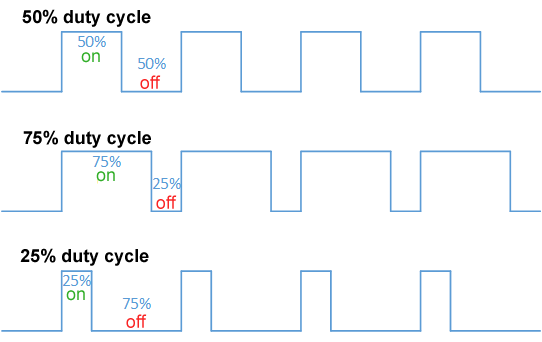
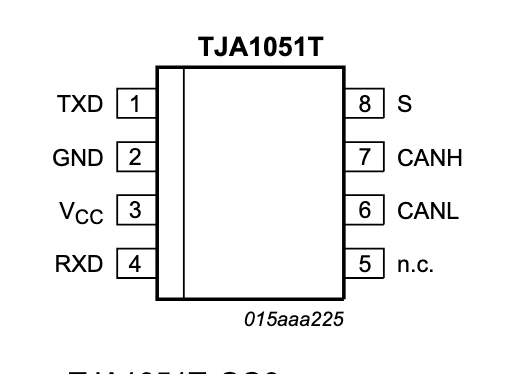
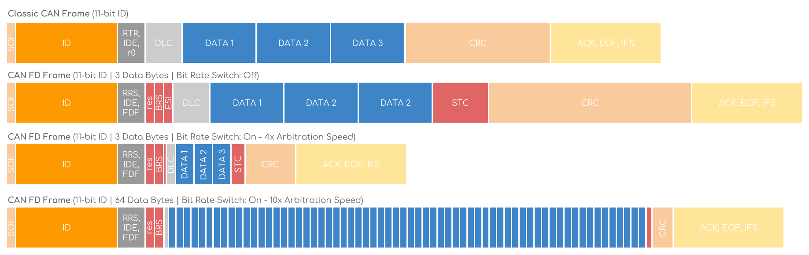

> Tags: I2C, SPI, UART, CAN, GPIO, DMA, ADC

# Reading for section 03: Peripherals and Protocols

**Goal:** Teach how to use the STM32 peripherals like the GPIO, ADC, Timers, and DMA, and communication protocols such as I2C and CAN.

In section 01, you were able to write firmware for an STM32 microcontroller to blink an onboard LED. In this section, you will learn more ways to blink that same LED and also learn to interface and communicate with external devices and peripherals.

---

## 0. GPIO

**GPIO** stands for **General-Purpose Input/Output**. It is a digital pin on a microcontroller that you can control through firmware programming. GPIOs are important because they allow your microcontroller to interact with the physical world. With GPIO pins, you can do plenty of things such as reading sensors, communicating with other devices, and controlling LEDs, motors, and other high voltage devices.

With GPIO being a digital pin, it can be in one of two states:

- **HIGH** (3.3V)
- **LOW** (0V)
  > Sometimes, development boards such as the Arduino will have HIGH as 5V, but the STM32 that you will be working with will use 3.3V as HIGH.

GPIOs can be programmed for various tasks. You can configure a GPIO to be either an:

- **Input**
  - Reading digital signals such as button presses
- **Output**
  - Sending digital signals out such as turning and LED on, or PWM signals

> You can also use GPIO inputs and outputs to emulate digital communication protocols that otherwise would not have been supported by the microcontroller using a technique known as [bit-banging](https://en.wikipedia.org/wiki/Bit_banging).

Although GPIOs are fundamentally digital pins, they can also be used as analog inputs/outputs, being able to read or output voltages between LOW (0V) and HIGH (+3.3V). Microcontrollers use a technique known as **PWM**, or **Pulse-Width Modulation** in order to simulate an analog output.

PWM works by rapidly switching a GPIO pin HIGH and LOW at an extremely high frequency, creating a signal what looks like a square wave. By varying the **Duty Cycle**, or the percentage of the time the square wave is HIGH compared to when it is LOW, you can control the level of voltage.

For example, if you wanted to output a GPIO pin at 1.65V, you would need a duty cycle of 50%. If you wanted an output of 0.825V, you would need a duty cycle of 25%.

PWM is especially important for LED dimming, as LEDs require a minimum voltage applied to turn on. With PWM, you are able to keep the LED at that voltage level without having it turn off. The LED dims because it turns on and off at a fast rate that your eyes cannot percieve, creating the illusion of dimming. You can also use PWM in the same context for controlling motor speeds.

### GPIO STM32 Example

## 1. CAN and CAN-FD

**CAN** stands for **Controller Area Network**. Its a 2-wire communication bus commonly used in automotive and industrial applications. Theres 3 layers to understading CAN: the 2 wire bus where nodes connect and communicate, the microcontroller/transciever interface, and the CAN message/frame (the actual data, and what it looks like to send a CAN message).

### 1a. The Two Wire Bus

CAN works like a group chat. Instead of having a master/slave to each node on the bus, theres a CAN_H and CAN_L line on which every node shouts its messages. Some nodes only read messages and dont send any, some send and receive, but regardless, all nodes on the same bus see eachothers messages. At the ends of the 2 wires are 120ohm termination resistors. Heres an example:

Its important to know what CAN_H and CAN_L are. CAN_H or CAN High ranges from 2.6v-5v, and is differential with CAN_L or CAN Low, which ranges from 0-2.6v . Like any digital message, data is sent in bits. When sending a "0", CAN_H and CAN_L are equal at ~2.6v. When sending a "1", CAN_H goes up to 5v and CAN_L goes down to 0v. When CAN_H increases, CAN_L decreases an equal amount. 

This is what "differential" means. The excited state is interpreted by the difference in CAN_H and CAN_L. So sending a bit on a CAN line consists of increasing the difference between CAN_H and CAN_L.

Why? CAN uses a twisted pair of wires it communicated on, and this in combination with differential signaling, means CAN is extremely resilient to noise.

## 1b. MCU Integration

Just like some microcontrollers may have SPI or UART pins, certain mcu's have a CAN core/CAN peripheral that are assigned CAN_TX and CAN_RX pins. Notice its not CAN_H and CAN_L. Microcontrollers do not directly connect to the CAN lines **EVER**, instead, their CAN_TX and CAN_RX are connected to a **CAN TRANCEIVER** which converts from TX/RX to CAN_H/CAN_L. CAN_TX is for sending messages, and CAN_RX is for receiving messages.

So on a PCB that uses CAN you will see: MCU --CANTX/RX---> CAN Transceiver --CANH/L---> CAN Line

Without getting too much into the hardware side, thats bascially all there is to CAN physically. Now we know how sending a bit works starting at the microcontroller. The beautiful thing about CAN is that you dont need a centralized connection to a switch like ethernet or other peripherals, instead you just have the distributed nodes. This allows for unique applications like daisy chaining that otherwise wouldnt be easily implemented.

### 1c. The CAN frame
Now, due to multiple nodes communicating on the same 2 wires, CAN messages have specific formatting that make sure we can actually send and receive messages without getting interrupted by other nodes trying to send a message at the same time and making a jumbled mess. To solve this we use **arbitration**
"CAN arbitration" refers to the non-destructive process on a Controller Area Network (CAN) bus that prevents data corruption when multiple devices attempt to send messages simultaneously. It works by comparing message identifiers, where a lower identifier number indicates a higher priority. The device transmitting the message with the highest priority (lowest ID) takes control of the bus, while other devices with lower-priority messages suspend their transmission and wait for the bus to become free again.
 
#### How CAN Arbitration Works

1. **Simultaneous Transmission Attempt:**
When multiple nodes on the CAN bus detect an idle bus and try to send a message at the same time, a potential conflict arises. 

2. **Dominant and Recessive Bits:**
The process relies on "dominant" (logic 0) and "recessive" (logic 1) bits. When a node transmits a recessive bit but senses a dominant bit on the bus from another node, it knows it has lost the "battle" for the bus. 

3. **Bitwise Comparison:**
Each transmitting node monitors the bus while it sends its message identifier. 

4. **Priority Determines Winner:**
The node that transmits a dominant bit at an earlier position in the identifier "wins" arbitration, taking control of the bus. 

5. **Suspension and Retransmission:**
The nodes that transmitted a recessive bit and lost arbitration immediately stop transmitting and wait for the bus to become idle again to try and retransmit. 

6. **Non-Destructive and Loss-Free:**
Because the high-priority message is never lost or corrupted and continues uninterrupted, the process is both non-destructive and ensures no data is lost. 

#### Features:

- **High-Priority Access:**
The device with the highest priority message (lowest ID) gets immediate access to the bus. 

- **Automatic Process:**
The arbitration process is handled automatically by the CAN controllers in each node. 

- **Guaranteed Bandwidth:**
Arbitration ensures that bandwidth is not compromised by message collisions. 

- **Real-time Priority:**
Message priority is allocated in real-time, making the CAN bus efficient for time-critical applications

The arbitration, message id, and header, combined with the actual data of the CAN message together is called a CAN Frame

This is where the actual difference between CAN and CAN-FD comes into play. CAN-FD (Flexible Data-rate) can specify how many bytes the message is going to be in its frame header, and can have up to 64 bytes of data per CAN frame/message. Normal CAN is maxed at 8 bytes and always sends 8 bytes. With normal CAN you can get bandwidth of up to 1mbit/sec whereas CAN-FD can get 5mbit/sec and even up to 8 with the right hardware. In DFR, we are moving to CAN-FD, as it is replacing standard CAN

TODO: Write tutorial on how to blink and dim the LED and how to poll button inputs

