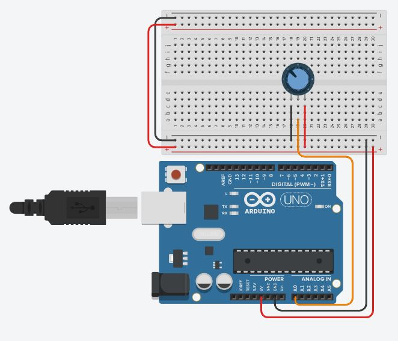

# Work for section 05

The tasks listed in this document also exist in the reading.
There will be some additional tasks and more specific instructions in this document.

# Analog Filtering Exercises

## Exercise 1: Fourier Series Visualization
Using Desmos, graph the fourier series given by the expression:
$$f(x)=\lim_{a\to\infty}\sum_{n=1}^{a}\frac{\sin((2n-1)2\pi x)}{2n-1}$$
 - When you put this into desmos, drop the limit and use $a$ as a parameter.
 - As you increase the value of $a$, you should see the waveform make a better approximation of a square wave.

You should be able to copy and paste the following into desmos, then press enter:
```f(x)=\sum_{n=1}^{a}\frac{\sin((2n-1)2\pi x)}{2n-1}```

You should see a slider appear for the variable $a$.

## Exercise 2: Experiment with Filtering
Build and experiment with your own low pass filter. You can do any of the following:
 - Build the filter in EveryCircuit
 - Build it in LT Spice
 - Build it in the real world

# Digital Filtering Exercises

## Exercise 1

In tinkercad, write a program to sample a signal using the ADC on an arduino.
Here is some example code:
``` c++
#define DEL 100
#define NUM 1000

void setup()
{
  Serial.begin(115200);
  int aout = 0;
  
  for (int i=0; i<NUM; i++)
  {
    aout = analogRead(0);
    Serial.println(aout);
    delay(DEL);
  }
}

void loop()
{
  
}
```
Here is an example design in tinkercad:



Play around with this design in tinkercad:
 - Add additional potentiometers
 - Change how the printing looks by using `Serial.print()` instead of `Serial.println()`
 - Print the actual voltage instead of the ADC conversion code

To find the voltage, assume the ADC code corresponds to a number between 0 and 5V.
Let 1023 be 5V, and 0 be 0V.
Use that information to correctly print the voltage.

Note that the loop() function is required, even though it is not populated.

## Exercise 2

Implement a digital filter in C.
Test it with the following:
 - Use an impulse
 - Use a sinusoid, and be sure the attenuation is as you expect

Notes about using an impulse:
 - This is the best method for testing a digital filter.
 - When an impulse is passed through a digital filter, the coefficients of the filter should be returned
 - An impulse is a delta function.
 In the digital domain, this is represented by a 1 at $n=0$ and a zero everywhere else.

Follow the data flow shown below:

 1. (Create a buffer) Data populates an $a$ point long buffer.
 2. While data is filling the buffer, invalid convolutions are being computed, so these outputs are discarded.
 3. When the buffer is full, the MAC is performed on the entire buffer with the entire filter kernel.
 4. When this happens, the first valid $v_{out}(n)$ point is created.
 5. This buffer is a First In, First Out (FIFO) buffer, so after the first valid complete MAC, the next $v_{in}$ point is shifted into the buffer, knocking the first one out.
 6. The next MAC is performed, and this process repeats every time the ADC produces a new sample.
