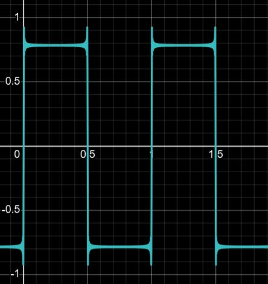
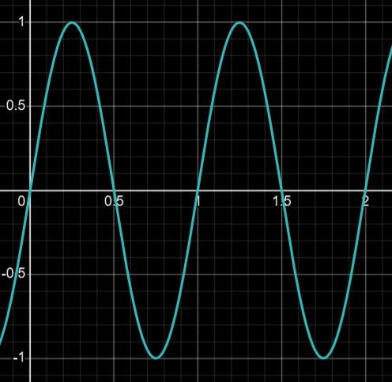
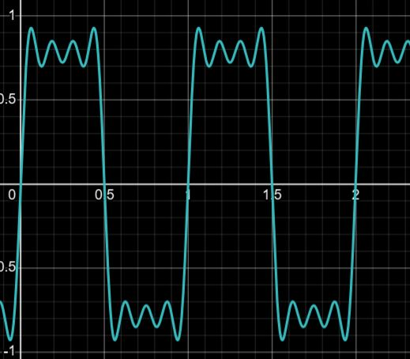
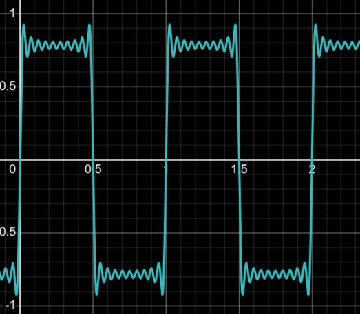
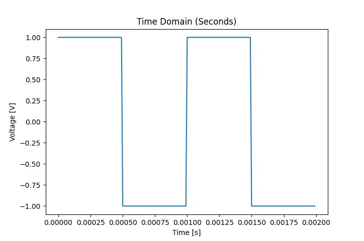
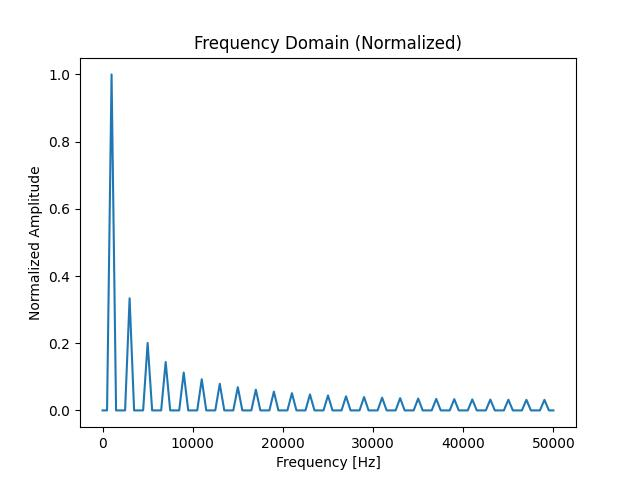
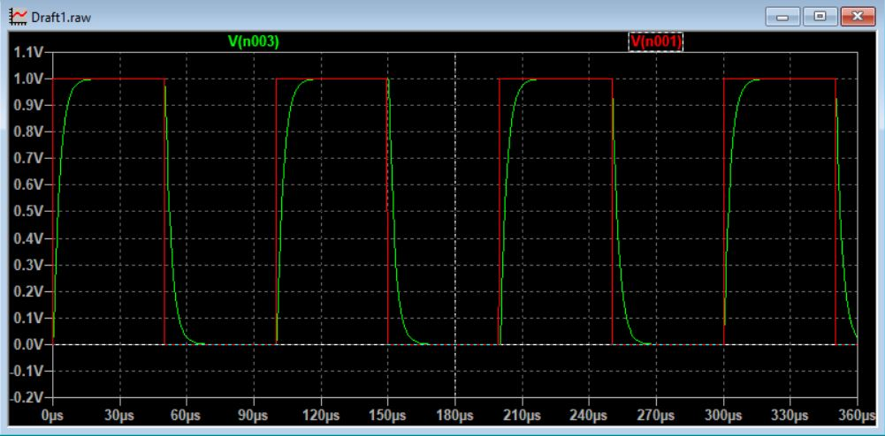
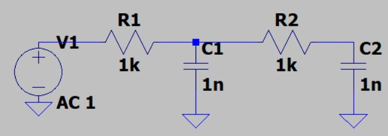
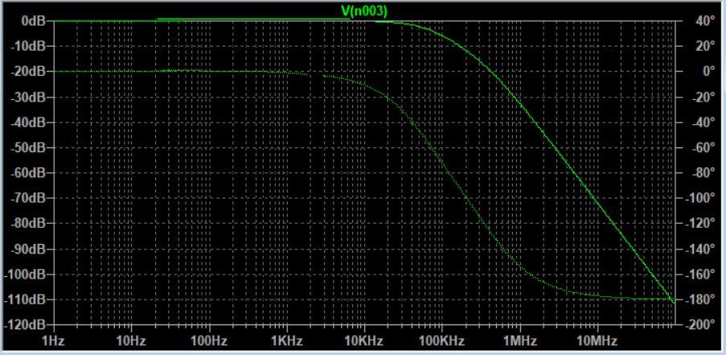

# Introduction

The purpose of filtering a signal is to get rid of noise.
The process of "analog filtering" is the use of *reactive* components to influence the spectrum of a signal (and thus get rid of noise).
Reactive components are components that store energy such as capacitors and inductors.

This will document not be a comprehensive overview by any means, but should provide enough information to give you a general idea of how analog filtering works.

NOTE: Please read this document before reading `digital_filtering.md`.

# Signal Spectra

When it comes to filtering, the most important question to ask is, "what am I filtering?"
To answer this question, we look to the classic example of a square wave.

To understand what filtering is, you must accept the notion that periodic signals are composed of a infinite sum of sinusoids, as described by the function's *Fourier Series*.

## Fourier Series

The *Fourier Series* is a specific mathematical representation of a periodic function.

Any periodic function can be described as a linear combination (sum) of sinusoids.
As an example, here is a square wave centered at the ground potential:

This function is described by an infinite sum of sinusoids:

$$f(x)=\lim_{a\to\infty}\sum_{n=1}^{a}\frac{\sin((2x-1)2\pi x)}{2x-1}$$

This can be more simply written as:

$$f(x)=\lim_{a\to\infty}\sum_{n=1}^{a}\frac{1}{n}\sin(2\pi nx)$$

Where $n$ is a positive odd integer.

If we let $a=1$, we see that this is the first sinusoid of the square wave, or more precisely, the *first harmonic*, whose frequency is at the *fundamental frequency* of the square wave.

Notice how the waveform evolves as we add more harmonics. If we let $a=2$:

If we let $a=4$:

If we let $a=10$:

From this series of graphs, it is clear to see that as $a\to\infty$, the graph better approximates a square wave.

Below is a 1 kHz square wave:

By applying what is known as the *Fourier Transform*, we can get a plot that tells us what sinusoids exist in a signal:

This graph shows us what the *spectrum* of the signal is.
At each peak, it shows us the relative amplitude of each sinusoid at their respective frequencies.
You may also think of each peak as a term in the fourier series, the amplitude and frequency of which will correspond to the graph.

## So, What am I Filtering?

When you put a square wave through a low pass filter, you are attenuating the higher frequency elements of the signal, and you loose the sharpness of the square wave. The effects are shown below:

The input voltage is the red waveform, and the output voltage is the green waveform.
The edges of the waveform are rounded off because the high frequency elements of the waveform have been attenuated.

# Filters and Frequency Response

Now that you have some understanding of what the spectrum of a signal is, we can scratch the surface of filtering using analog devices.

## RC Low Pass Filters

The purpose of filtering is to rid a signal of unwanted noise. 
One of the most common types of filters is the *RC low pass* filter. 
The filter is an *RC* filter because it uses exclusively resistors and capacitors.
The filter is called a *low pass* filter because it only allows low frequency energy to pass through it.

Here is an example of a low pass filter drawn up in LT Spice:

The voltage source represents the input of the filter, and the connection point between R2 and C2 is the output of the filter.

## Bode Plots

We study the performance of filters using a *Bode Plot* as shown below. This bode plot is graphed when LT Spice simulates the circuit presented previously.

The bode plot is a representation of the filter's *frequency response*. That is, how the output compares to the input as a function of frequency. The is also commonly referred to as the spectrum of the *impulse response*.

As before, the horizontal axis is frequency. The vertical axis however, is in decibels (dB). The reasons for this will become apparent later. There are two curves in the graph. The solid line represents the *magnitude*, and the faded line represents the *phase* response.
For our purposes, we will only focus on the magnitude response of a filter.

At the low end of the spectrum, we see that the magnitude plot shows 0 dB.
This means the signal is not *attenuated* by the filter, or that is is passed through without a drop in amplitude.
This will be mathematically formalized in terms of a *transfer function* later.
As the frequency increases beyond a critical point (-3 dBs), the signal becomes *attenuated* (the amplitude is reduced).
The higher the frequency, the more strongly attenuated it becomes when it tries to pass through the filter.
In other words, the higher the frequency, the more strongly the filter attenuates the signals.

## Transfer Functions and Decibels

The bode plot is derived from the application of kirchhoff's laws.
This derivation is outside the scope of this work, but the point of the mathematics is to arrive at an expression for the output voltage $V_{out}$ and the input voltage $V_{in}$.

Recall that the purpose of the bode plot is to compare the input to the output as a function of frequency. This gives rise to the concept of the *transfer function* ($H$), which is defined as the ratio of the output voltage to the input voltage:

$$H=\frac{V_{out}}{V_{in}}$$

The magnitude response is written in dBs, and is defined as:

$$20\log_{10}|H|$$

Note that when the input is equal to the output:
$$|H|=1\therefore20\log_{10}|H|=0 \text{ dB}$$

The transfer function $H$ is defined in the frequency domain, which means $H$ is a function of frequency. Therefore it is commonly written as $H(\omega)$ or $H(s)$

# Applications

Now that we have discussed the basics of analog filtering, we are ready to discuss where it is applied on the DFR team.

## Anti-Aliasing Filters

On the DFR team, analog filters are specifically designed to support *Analog to Digital Converters* (ADCs), which are devices that digitize an analog signal.
When we want to digitize a signal, our goal it to sample the signal repeatedly so that we know what the voltage is as it varies with time.
Since we cannot store an infinite amount of data and we cannot sample the signal infinitely fast, we are constrained to a sampling rate.

Since we are constrained by how fast we can sample, we are also constrained by what frequencies we can represent in the digital domain.
Specifically, the maximum frequency we can faithfully represent using an ADC is at half the *sampling rate* ($f_s$).
For example, if I sample a signal at 100 Sa/s, I can only faithfully represent signals up to 50 Hz. This is known as the *nyquist theorem*, and that maximum frequency is what I will refer to as the *nyquist frequency* ($f_n$).

$$f_n=\frac{f_s}{2}$$

When energy beyond this frequency exits in the signal, it shows up in the digital domain as an *alias* of itself. This alias shows up as energy between 0 and $f_n$ Hz, which is added noise that prevents us from reconstructing the signal correctly.

To get around this problem, we use *Anti-Aliasing Filters*, which are low pass RC filters when used on the DFR team.

To design the filter, you consider the *quantization step* of your ADC.
This is derived from the *resolution* of the ADC:

$$q=\frac{1}{2^n}$$

Where $n$ is the resolution of the ADC, typically 12 to 16 bits. (So $n=12$ or $n=16$ on a typical ADC). Use this number to determine how hard your filter must attenuate energy at the nyquist frequency.
In dBs, the quantization step is represented as:

$$A=20\log_{10}(q)$$

For example, if you have a 16 bit ADC and are sampling at 80 MHz:

$$f_n=\frac{80M\text{ Hz}}{2}=40M\text{ Hz}$$

Where $M=10^6$

Then you must attenuate everything at 40 MHz or more at least:

$$20\log_{10}\left(\frac{1}{2^{16}}\right)=-96\text{ dB}$$

Which is possible with the following circuit:

# Challenge

Build and experiment with your own low pass filter. You can do any combination of the following:
 - Build the filter in EveryCircuit
 - Build it in LT Spice
 - Build it in the real world
